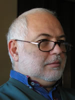

### Contact

- Mobile: +381 64 10 38 277
- [milan.andrejevic@gmail.com](mailto:milan.andrejevic@gmail.com)
- Milesevska 40/VIII/32, 11000 Belgrade, Serbia

### Profile
I am a versatile, hands-on developer with experience of working on a variety of projects from conception to delivery. I am conversant in a wide range of technologies - most notably Google App Engine - and follow the latest industry trends with great interest. My approach is methodical and creative, and I code to the highest standards possible. I am a confident communicator and I am comfortable working either independently or as part of a team.

### Skills Summary

- Google App Engine, Google API, Twilio API, Google Maps, Django, GeoDjango
- Google NDB, PostgreSQL, SQL Server
- D3, Node.js, Python, XML, XSLT, RSS, SVG, HTML / CSS / JavaScript

### Education

**2011** Equilibrio, Center for Foreign Languages, Belgrade</strong> 
Certificate of passed Business English course at the Intermediate level B2

**1999** Bühler AG, ANATEC Uzwill, Switzerland</strong>,
Certificate of passed training course regarding NIRVIS spectrophotometer, FT-NIR technology, Chemometrics and NIRCAL software

**1974** Institute of Foreign Languages Belgrade</strong> 
Certificate of passed Intermediate "C" in English

**1973-1979** University of Belgrade, Faculty of Technology and Metallurgy, Master's degree in Chemical Engineering, Organic Chemical Technology and Polymer Engineering

### Employment History

**2010-present** [GroundLink](http://www.groundlink.com/), New York, USA, Belgrade Office, **Senior developer**

- Pricing Configuration, Promotion codes app.
- Development of bulk SMS application on Google App Engine using Twilio API
- Development of application for monitoring driver position availability via stream using sockets and D3
- Successfully built and maintained various application supporting company needs (Promotions, Lead times, Deals)
- Real-time mobile driver application, hosted remotely, using 12 internal API services
- Development of Dispatch maps, real-time driver and job tracking application
- Django admin application for back end database support. GeoDjango admin application for drawing areas of interest
- XSLT email templates for company - customer notifications

**2007-2010** [European Dynamics](http://www.eurodyn.com/), Athens, Greece, CEETEL, now [Realaiz](http://realaiz.com/) Belgrade, **CTO and Web designer/ developer**

- Administrative task to ensure operational environment of the office
- Successfully built and maintained various sites: [Ministère de la Justice et des droits de l'Homme](http://www.e-justice.tn/), République Tunisienne, Geographical Search and Advanced Comparisons for [Eurostat](http://epp.eurostat.ec.europa.eu/portal/page/portal/eurostat/home), German eProcurement, [Cyprus eProcurement](https://www.eprocurement.gov.cy/ceproc/home.do), [NHS-sid Supplier Information Database](http://www.sid4health.nhs.uk/home.action), [Europe Direct](http://ec.europa.eu/europedirect/index_en.htm), [eACE](http://www.eace.info/), European Commission Geographical Information Portal, [European Railway Agency](http://www.era.europa.eu/), [Europe INNOVA](http://www.europe-innova.eu/), EU Biosafety Clearing-House, [REPORTNET](http://www.eionet.europa.eu/reportnet) WebDashboards Service, [Opendays 2005](http://ec.europa.eu/regional_policy/opendays/index.cfm), Web Survey Tool and Forums design for [Eures Portal](http://ec.europa.eu/eures/), Unified Notification Service for [EIONET](http://www.eionet.eu.int/)

**2000-2007** [European Dynamics](http://www.eurodyn.com/), Athens, Greece, CEETEL, now [Realaiz](http://realaiz.com/) Belgrade, **Web designer/ developer**

 - Successfully built and maintained various sites: Office of the ombudsman, Office of the information commissioner and Standards for Republic of Ireland
 - [Structural Funds](http://ec.europa.eu/regional_policy/funds/prord/sf_en.htm), [EUROSTAT](http://epp.eurostat.ec.europa.eu/portal/page/portal/eurostat/home/), [FEB](http://www.feb.ba/), [Unotex](http://www.unotex.co.ba/), [Pliva BIH](http://www.pliva.ba/), [Grawe BIH](http://www.grawe.ba/) and [Hotel Hondo](http://www.hotelhondo.ba/), [European Commission Internal Audit Service](http://ec.europa.eu/dgs/internal_audit/index_en.htm), [Court of Justice of the European Union](http://curia.eu.int/), [Directorate-General for Education and Culture](http://ec.europa.eu/dgs/education_culture/index_en.htm), [Ecological Resource Center Yugoslavia](http://www.erc.org.yu/), [Bulletin & General report of the European Union](http://europa.eu/bulletin/en/welcome.htm), [Dialogue with Citizens](http://ec.europa.eu/youreurope/nav/en/citizens/index.html), [Justice and Home Affairs](http://ec.europa.eu/justice_home/index_en.htm), EUROPEAN PARLIAMENT FACT SHEETS, [EUR-Lex](http://eur-lex.europa.eu/), Interactive Well-Being, [One Stop Internet Shop for Business](http://ec.europa.eu/youreurope/business/index_en.htm), [Pressure Equipment Directive](http://ec.europa.eu/enterprise/sectors/pressure-and-gas/documents/ped/), [EUROPA-Publications Office](http://publications.europa.eu/)

**1999-2000** Zorka Pharma Sabac **NIR (near infra red) application engineer**

- Establish statistical raw substances quality control by building mathematical models using muilt-dimensional statistical analasys of NIR spectra

**1980-1999** Chemical Industries Zorka, Plant protection Department, Sabac, **R&D engineer, Herbicide synthesis production manager, CTO, Chief engineer**

- Organization and managing of ISO 9000 and other technical documentation 
Accurate tank volume calculation for horizontal cylindrical shells with ASME or torispherical heads using AutoCAD and MS Excel interpolation formula
- Production established increase of Prometrine herbicide quality by 5 - 10%, quantity by 30%. Energy consumption lowered by 10%
- Improving incineration efficiency for waste gases. Purchasing custom made pumps for highly toxic Dimethyl slulphate, hence lowering the environmental and spill hazard risks. Improved energy efficiency and lowering environmental impact for Prometrine herbicide suspension filtration and drying. Improving jet-milling efficiency for dry pesticide milling. Improving cyclone efficiency in sulfur milling.
