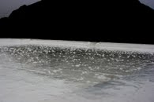

Ovaj odmor smo Mihailo i ja iskoristili da popravimo krov na nasoj kući u Mišićima. Krov nam je dosta bio propao posle prolećnih kiša u Crnoj Gori pa je popravka bila neohodna.

Prvo smo krov očistili malo od starog premaza špahtlom. Prilikom čiščenja se, naravno otvorio novi problem: sa starim slojem se ponegde skinuo i beton u debljini od oko 5mm. Prvo smo morali sve ovo da očistimo i da popravimo lepkom za pločice i da se to lepo osuši. Kada je to bilo gotovo, namazali smo prajmer sloj [Adingflex-a](http://www.ading.com.mk/documents/pdf/06%20Adingfleks.pdf) preko celog krova. Pošto je krov prilično star i neravan, trošili smo malo više premaza nego što je prvobitno bilo predviđeno. Posle 24 sata smo naneli debeli sloj Adingflex-a. Opet smo trošili više nego uobičajeno pa smo morali da dokupimo jos materijala. Ukupno smo potrošili 45kg premaza.

Stalno smo pratili vremensku prognozu jer na premaz nebi trebalo da padne kiša 48 sati posle nanošenja.

Bilo je problema oko nabavke materijala, morali smo da ga kupimo u Budvi, jer u Baru su prodavci odlučili da je kraj sezone i da ne treba više nabavljati građevinski materijal. Prodaje se samo ono što se našlo na lageru. Ovo je već bilo tipično crnogorsko rezonovanje, koje nas stalno iznenađuje, iako smo mislili da nas nista više ne može iznenaditi.

